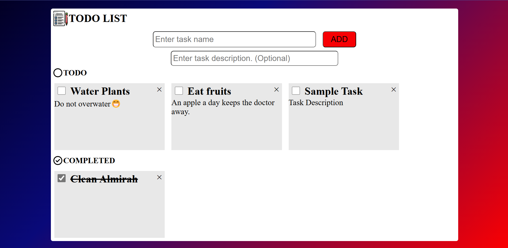

<h1>FRONTEND TO-DO APP</h1>
I created this project to practice core concepts HTML, CSS and JavaScript
A todo list is a good beginner level project to test your capablities in dynamic frontend webapp developement.
The app allows users to create, manage, and delete tasks directly in the browser.


---

### Table of Contents
- [Preview](#preview)
- [Features](#features)
- [Technologies Used](#technologies-used)
- [Setup](#setup)
- [Usage](#usage)
- [Folder Structure](#folder-structure)

---

### Preview


---
### Features

- Add new tasks with ease.
- Mark tasks as completed or uncompleted.
- Delete individual tasks.
- User-friendly and intuitive interface.
- Persist tasks using local storage.

---

### Technologies Used

- **HTML**: For structuring the app.
- **CSS**: For styling the interface.
- **JavaScript**: For adding functionality and interactivity.

---

### Setup

1. **Clone the repository:**

    ```bash
    git clone https://github.com/yourusername/todo-list-app.git
    ```

2. **Navigate into the project directory:**

    ```bash
    cd todo-list-app
    ```

3. **Open `index.html` in your browser:**

    No additional setup or server is required. You can directly open the `index.html` file in any modern browser.

---

### Usage

- **Add a task**: Type the task in the input field and press the 'Add' button or hit 'Enter'.
- **Mark task as complete**: Click the checkbox next to the task to toggle between completed and incomplete states.
- **Delete a task**: Click the 'Delete' icon next to the task to remove it from the list.

---

### Folder Structure

```plaintext
todo-list-app/
│
├── images                    # Folder for other static images
│
├── screenshots/              # Folder for app preview images
│   └── preview.png           # Screenshot used in README
│
├── app.js                    # JavaScript file for app functionality
├── styles.css                # CSS file for styling the app
└── index.html                # Main HTML file
```

---


### Author

Created by **[Lavish Agarwal]**
Feel free to reach out at **[agrwl.lavish@gmail.com]** or connect with me on **[@lavish_agrwl]**.

---

### Future Enhancements (Optional)
- Implement task editing.
- Add categories or priorities for tasks.

---

Happy coding! 😊
